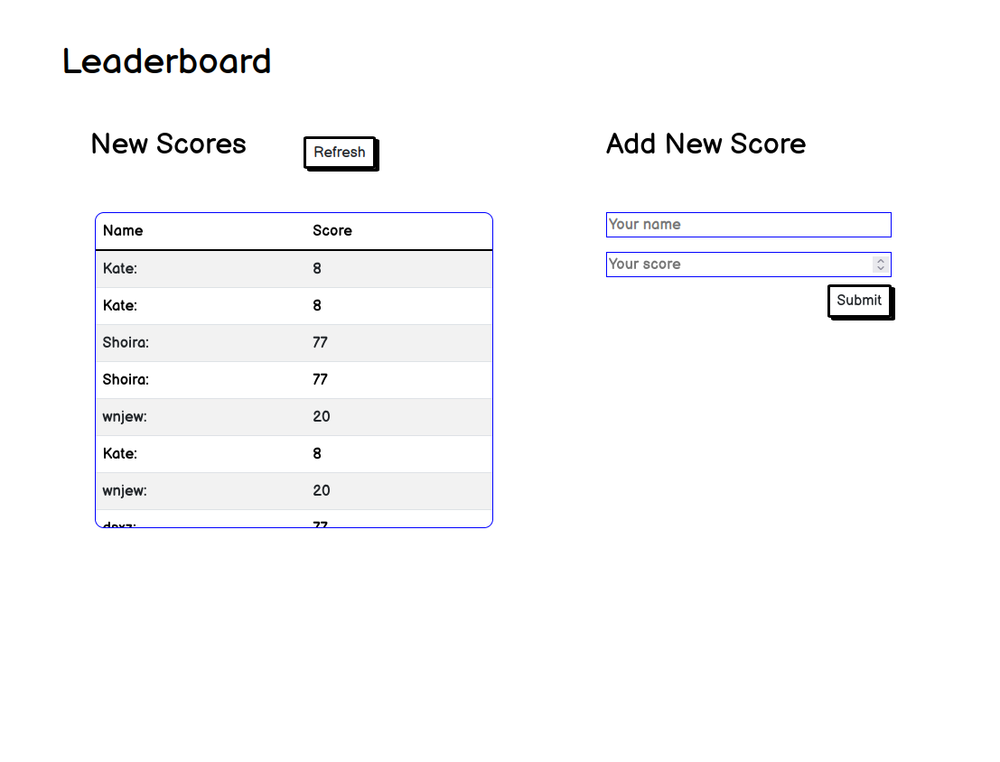

# Leaderboard
In this project I will set up a JavaScript project for the Leaderboard list app, using webpack and ES6 features, notably modules. In the first stages I will be working on the version of the app following a wireframe, but without styling - just focus on functionality. In following activities, I will consume the Leaderboard API using JavaScript async and await and add some styling.



## Built With

- Javascript
- Webpack
- HTML 5
- CSS 3

## Live Demo

[Live Demo Link](https://angelacuahutle.github.io/Leaderboard/src)

## Author

👤 **Angela Cuahutle**

- GitHub: [@angelacuahutle](https://github.com/angelacuahutle)
- LinkedIn: [Angela Cuahutle](https://www.linkedin.com/in/angelacuhautle)


## Usage
### Local installation
```console
$ git clone git@github.com:angelacuahutle/Leaderboard.git
$ cd Leaderboard
$ npm install 
```

### To run the project
```console
$ npm start 
```

## 🤝 Contributing

Give a ⭐️ if you like this project!

Contributions, issues, and feature requests are welcome!

Feel free to check the [issues page](https://github.com/angelacuahutle/Leaderboard/issues).

## 📝 License

This project is [MIT](./LICENSE.md) licensed.
This project is [MIT](./LICENSE.md) licensed.